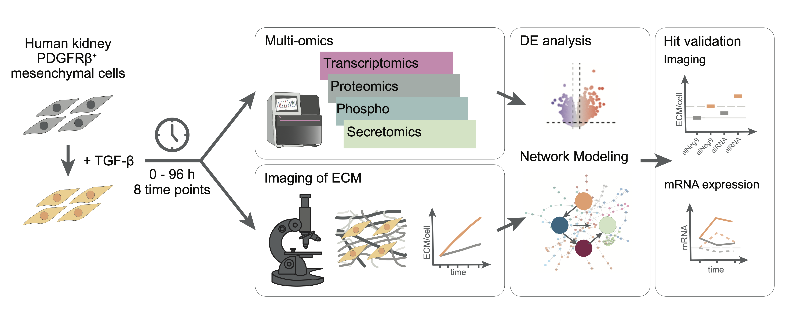

# Dynamic multi-omics and mechanistic modeling approach uncovers novel mechanisms of kidney fibrosis progression

## Background

Kidney fibrosis, characterized by excessive extracellular matrix (ECM) deposition, is a progressive disease that, despite affecting 10% of the population,  lacks specific treatments and suitable biomarkers. Aimed at unraveling disease mechanisms and identifying potential therapeutic targets, this study presents a comprehensive, time-resolved multi-omics analysis of kidney fibrosis using an in vitro model system based on human kidney PDGFRβ+ mesenchymal cells. Using computational network modeling we integrated  transcriptomics, proteomics, phosphoproteomics, and secretomics with imaging of the extracellular matrix (ECM). We quantified over 14,000 biomolecules across seven time points following TGF-β stimulation, revealing distinct temporal patterns in the expression and activity of known and potential novel renal fibrosis markers and modulators. The resulting time-resolved multi-omic network models  allowed us to propose mechanisms related to fibrosis progression through early transcriptional reprogramming. Using siRNA knockdowns and phenotypic assays, we validated predictions and elucidated regulatory mechanisms underlying kidney fibrosis. Notably, we demonstrate that several early-activated transcription factors, including FLI1 and E2F1, act as negative regulators of collagen deposition and propose underlying molecular mechanisms. This work advances our understanding of the pathogenesis of kidney fibrosis and provides a valuable resource for the organ fibrosis research community. 

  
---

## Repository structure

- in [*code*](code) all code to redo the included analyses can be found
- multi-omics and qPCR data analysis is divided upon 6 scripts (01-06) in [*code*](code) 
- three additional scripts for image preprocessing and analysis are provided for the COL1 imaging experiments in  [*code/COL1|ECM_image_analysis*](code/COL1|ECM_image_analysis) 
- all code to recompute paper figures and tables is provided in  [*code/figures_tables*](code/figures_tables) with one script per figure
- source data to reproduce plots is provided in [*data*](data) as RData objects
- raw data is deposited in the linked PRIDE and ArrayExpress repos